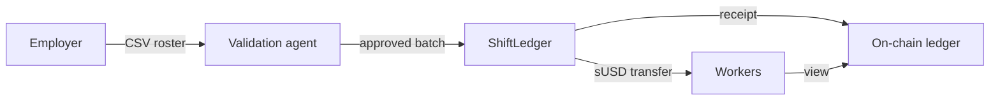
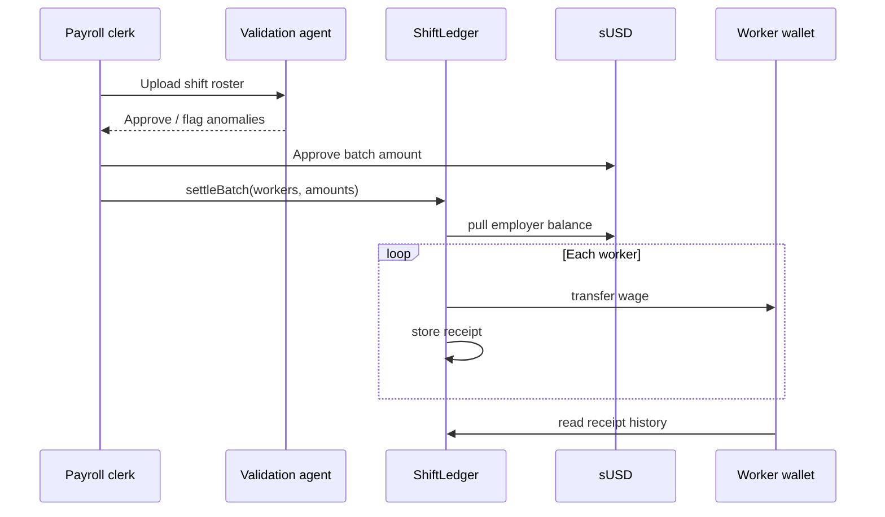

<p align="center">
  
</p>

<h1 align="center">ShiftLedger</h1>

<p align="center">
  <strong>Stablecoin payroll for industrial shift workers</strong><br/>
  Validate · Batch pay · On-chain receipts
</p>

<p align="center">
  <a href="https://shiftledger-nine.vercel.app"></a>
  <a href="https://sepolia.etherscan.io/address/0x5b421eb54218b48c7064605fb957ffef2b6b5f8a"></a>
  <a href="#license"></a>
</p>

<p align="center">
  <a href="https://shiftledger-nine.vercel.app">Live app</a> ·
  <a href="https://github.com/thesithunyein/shiftledger">GitHub</a> ·
  <a href="docs/ARCHITECTURE.md">Architecture</a>
</p>

---

## What it is

ShiftLedger helps factory payroll clerks **upload shift rosters**, **validate payroll with an AI agent**, and **batch-settle stablecoin wages** with immutable on-chain receipts for every worker.

| Step | Actor | Action |
|------|-------|--------|
| Upload | Employer | CSV shift roster |
| Validate | AI agent | Hours, rates, wallet checks |
| Settle | Employer | One stablecoin batch tx |
| Verify | Worker | On-chain wage receipt |

---

## How it works





Full notes: [`docs/ARCHITECTURE.md`](docs/ARCHITECTURE.md)

---

## Try it

1. Open **[shiftledger-nine.vercel.app](https://shiftledger-nine.vercel.app)**
2. Connect wallet on **Ethereum Sepolia**
3. Click **Run payroll flow** (or Load sample → Validate)
4. Review **Payroll Intelligence Agent** — policy checks + reasoning trace
5. **Get sUSD** → **Settle** → open **Receipts** for on-chain proof

---

## Stack

| Layer | Tech |
|-------|------|
| Contracts | Hardhat 3 · Solidity · OpenZeppelin |
| Stablecoin | MockUSDC (sUSD) on Sepolia |
| App | Vite · React · wagmi · viem |
| Validation | Payroll intelligence engine |

---

## Sepolia contracts

| Contract | Address |
|----------|---------|
| ShiftLedger | [`0x5b42…5f8a`](https://sepolia.etherscan.io/address/0x5b421eb54218b48c7064605fb957ffef2b6b5f8a) |
| sUSD | [`0x4c48…76d6`](https://sepolia.etherscan.io/address/0x4c485e4028041e9b27ee65efcfe1cd74f0ca76d6) |

---

## Development

```bash
git clone https://github.com/thesithunyein/shiftledger.git
cd shiftledger
npm run install:all
cp .env.example .env
npm run compile
npm run deploy:sepolia
npm run dev
```

Vercel root directory: `frontend`

---

## Roadmap

| Phase | Deliverable |
|-------|---------------|
| Now | Sepolia demo, batch settle, on-chain receipts |
| Next | MYR/PHP off-ramp via regulated partners (BSP sandbox) |
| Next | HRIS CSV export + auditor dashboard |
| Next | Cloud LLM agent (Google Cloud / AWS Lambda) |

## Limitations (honest)

- Testnet only (Sepolia) with mock sUSD
- Payroll agent uses policy rules today — LLM API-ready architecture
- Single-employer demo; multi-factory admin planned
- Workers need a wallet (social recovery / AA planned)

## License

MIT
