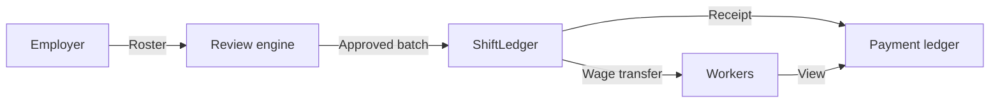

<p align="center">
  
</p>

<h1 align="center">ShiftLedger</h1>

<p align="center">
  <strong>Payroll for factory shift workers</strong><br/>
  Review rosters · Pay the week · Verified pay slips
</p>

<p align="center">
  <a href="https://shiftledger.sithunyein.com"></a>
  <a href="https://github.com/thesithunyein/shiftledger/actions/workflows/ci.yml"></a>
  <a href="LICENSE"></a>
</p>

<p align="center">
  <a href="https://shiftledger.sithunyein.com">Live app</a> ·
  <a href="docs/ARCHITECTURE.md">Architecture</a> ·
  <a href="docs/SECURITY.md">Security</a>
</p>

---

## Product

ShiftLedger is a **factory payroll workspace** for industrial teams.

HR adds this week’s workers, runs an automated roster review (hours, overtime, rates, payout accounts), pays the team in one batch, and every worker receives a **verified pay slip**.

| Step | Who | What happens |
|------|-----|----------------|
| 1 | Employer | Add workers or import a CSV roster |
| 2 | Review engine | Flags overtime, rate anomalies, invalid payout accounts |
| 3 | Employer | Pays the approved batch |
| 4 | Worker | Opens verified pay slips for their account |

**Who it’s for**

- Factory HR / payroll clerks
- Shift workers who need clear proof of wages
- Operations teams that want an audit trail without spreadsheet chaos

---

## Live product

**App:** [shiftledger.sithunyein.com](https://shiftledger.sithunyein.com)

1. Sign in with your payout account  
2. Add workers (or import CSV)  
3. Review roster → **Pay team**  
4. Open **Pay slips** for verified records after payment  

Network today: **Ethereum Sepolia** (testnet) with mock sUSD for safe trials. Same product flow is designed for mainnet stablecoin settlement later.

---

## How it works



Details: [`docs/ARCHITECTURE.md`](docs/ARCHITECTURE.md)

---

## Stack

| Layer | Tech |
|-------|------|
| Contracts | Hardhat · Solidity · OpenZeppelin |
| Settlement | MockUSDC (sUSD) on Sepolia |
| App | Vite · React · wagmi · viem |
| Review | Policy-based payroll intelligence engine |

---

## Contracts (Sepolia)

| Contract | Address |
|----------|---------|
| ShiftLedger | [`0x5b421eb54218b48c7064605fb957ffef2b6b5f8a`](https://sepolia.etherscan.io/address/0x5b421eb54218b48c7064605fb957ffef2b6b5f8a) |
| sUSD | [`0x4c485e4028041e9b27ee65efcfe1cd74f0ca76d6`](https://sepolia.etherscan.io/address/0x4c485e4028041e9b27ee65efcfe1cd74f0ca76d6) |

---

## Development

```bash
git clone https://github.com/thesithunyein/shiftledger.git
cd shiftledger
npm run install:all
cp .env.example .env
npm run compile
npm run test
npm run dev
```

- App root for Vercel: `frontend`
- Env template: [`.env.example`](.env.example)
- Contributing: [`CONTRIBUTING.md`](CONTRIBUTING.md)

---

## Roadmap

| Phase | Focus |
|-------|--------|
| Now | Live payroll workspace on Sepolia · roster review · batch pay · verified slips |
| Next | Mainnet stablecoin settlement · regulated off-ramp (MYR / PHP) |
| Next | HRIS CSV sync · auditor dashboard · multi-factory orgs |
| Later | Account abstraction for workers · cloud LLM review assist |

## Current limitations

- Testnet settlement only (Sepolia + mock sUSD)
- Review engine uses deterministic policy rules (LLM-ready architecture)
- Single employer workspace (multi-org admin planned)
- Workers need a payout account (simpler onboarding planned)

---

## License

[MIT](LICENSE)
