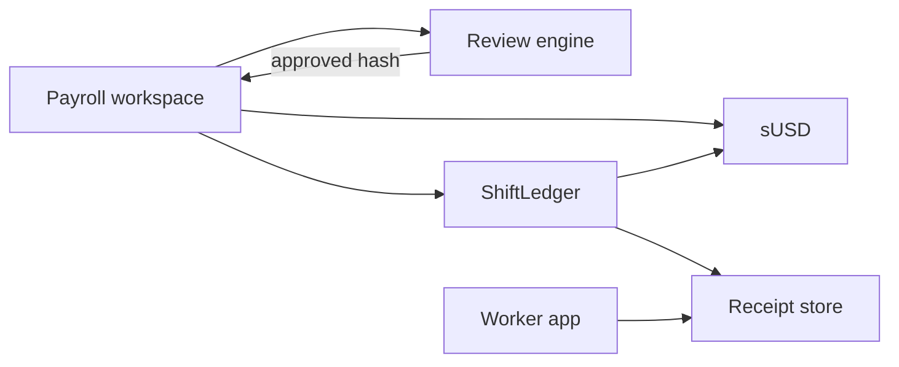

# Architecture

ShiftLedger is a factory payroll product: employers build a weekly roster, a review engine checks it, then a smart contract settles wages and stores pay-slip receipts.

## Product flow

1. Employer signs in with a payout account
2. Employer adds workers (UI) or imports CSV (`name,wallet,hours,rate_usd,role`)
3. Review engine scores hours, rates, overtime, and payout accounts
4. Employer pays an approved batch via `ShiftLedger.settleBatch`
5. Each worker can read immutable receipts for their account

## System diagram

## Components

| Piece | Role |
|-------|------|
| `frontend/` | React payroll workspace (wagmi / viem) |
| `contracts/ShiftLedger.sol` | Batch settle + per-worker receipt |
| `contracts/MockUSDC.sol` | Testnet stablecoin (faucet for pilots) |
| `frontend/src/lib/payrollAgent.ts` | Deterministic roster policy engine |

## Trust model

- **Employer** authorizes payouts from their account
- **Review engine** runs client-side before settlement (does not move funds by itself)
- **Ledger** enforces batch transfers and stores receipt fields (amount, role, period, timestamp)
- **Worker** proves payment by reading receipts for their address

## Networks

| Env | Network | Notes |
|-----|---------|--------|
| Current | Ethereum Sepolia | Public pilot / demo-safe |
| Planned | Mainnet + stablecoin | Production settlement |

## Data handling

- Roster drafts can persist in browser `localStorage` for the signed-in session workflow
- No central database of worker PII in the current release
- On-chain receipts store payroll metadata needed for proof (not full HR profiles)

See also: [`SECURITY.md`](SECURITY.md)
